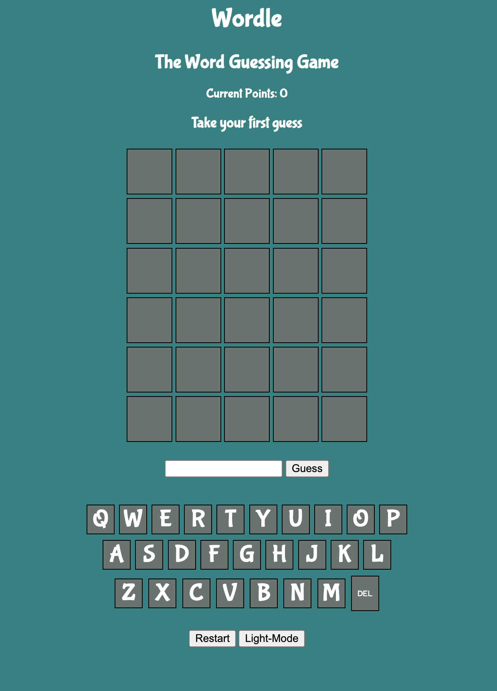

 # Wordle Ga Project 1
 ---
### The Five Letter Word Guessing Game
Wordle is a word guessing game that I loved during lockdown and I felt could be a good project to start<br>
I wanted to choose worldle to start improving my ability in CSS, JavaScript and HTML and i felt this was a good starting point.




## Rules
---
below is the HTML for the rules of the game 

```html
    <li class="all-rules hidden">Each guess must be a five-letter word.</li>
    <li class="all-rules hidden">The tiles will change colour with your guess</li>
    <li class="all-rules hidden">Yellow and bold means right letter wrong spot</li>
    <li class="all-rules hidden">Green and underlined means right letter right spot</li>
    <li class="all-rules hidden">Red and italic squares on the keyboard are incorrect letters</li>
```

## Description 
---
The program uses a random number to choose that rounds wordle from a data list then the player has 6 guesses <br> in which 7 functions check the word against the worlde and display any relevant changes necessary for the game to progress.


Current playGame function
``` js
function playGame() {
    if (currentWordle === '') {
        randomWord()
    } else if (winner === true) {
        return
    } else if (lost === true) {
        return
    } else
        if (currentWordle !== '') {
            storeGuess()
            displayPlayersGuessInChars()
            currentWordleArray = currentWordle.split("")
            checkCharsMatch(currentWordleArray)
            rightSpotWrongSpot()
            changeColorOfGuesedCharactures()
            checkWinner()
            displayWinOrLose()
            guessInput.value = ''
        }
}

```


## Getting Started
---
This is currently a early working worlde game that is fitted to be used on phones or desktops and is current live on. <br>
https://kizzathorley.github.io/GA-Project-1/


## Acknowledgments 
---

https://www.nytimes.com/games/wordle/index.html
initial game concept 

https://byjus.com/english/5-letter-words/
Used to gather an initial list of words


## Technologies
---
Languages Used in This Project
<br>***JavaScript***: Used to impliment the game logic
<br>***Html***: structed the game layout and content 
<br>***Css***: used to style and infer information clearly on the page


## Next Step 
---
Future iterations add new logic including a reduce() to organise for words with multiple of the same letter displaying location on the board. 

``` js 
function rightSpotWrongSpot() {
    if (playersGuessArray.length === 0) {
        return
    } else {
        for (let currentIdx = 0; currentIdx <= 4; currentIdx++) {

            if (matchedCharacturesInGuesses[currentWordleGuessIdx][currentIdx] === currentWordleArray[currentIdx]) {
                guessCharactureDivs[currentIdx + currentGuessSqrIdx].classList.add('in-word')
            }
            else if (matchedCharacturesInGuesses[currentWordleGuessIdx][currentIdx] !== currentWordleArray[currentIdx]
             && matchedCharacturesInGuesses[currentWordleGuessIdx][currentIdx] !== '') {
                guessCharactureDivs[currentIdx + currentGuessSqrIdx].classList.add('in-wrong-spot')
            } 


        }
    }
}

```

Additionally adding a new function to animate the dropdowns of the rules and reset the score button are in the works.
``` js 
function rulesDropdown() {
    const rulesList = document.querySelectorAll('.all-rules')
    rulesList.forEach((rule) => {
        if (rule.classList.contains('hidden')) {
            rule.style.transition = 'opacity 0.5s ease-in';
            rule.classList.remove('hidden')
            setTimeout(() => {
                rule.style.opacity = '1';
            }, 500);
        } else {
            rule.style.opacity = '0'
            setTimeout(() => {
                rule.style.transition = 'none';
                rule.classList.add('hidden')
            }, 500);
            
        }
    })
}

``` 

<br>
Future iterations to the current accessibility will be added to create a fluid experience for everyone who plays the game<br>
the current solution is to use bold italic and underline but can be changed to not change the visuals but work with screen readers.

```CSS
.not-in-word {
    background-color: rgb(220, 41, 41);
    font-style: italic;
    
}

.in-word {
    background-color: rgb(22, 180, 8);
    text-decoration: underline;
}

.in-wrong-spot {
    background-color: rgb(206, 203, 11);
    font-weight: bold;
}
```

Future iterations are to combine more word-based games and a landing page to allow one to play multiple word guessing games with the first to be Hangman. <br>
additionally, more words will be added to the data file to increase the number of appearing 5-letter words

## Key Learning Points 
---
1. **Shortening Logic:** one of the most important things I found during the project was how to spot repeatable processes in my logic <br>
to make my code more efficient and how to think about these from the first time writing.
2. **Planning with psudo code :** I felt that one of my strong points was the planning however in this I need to split functions up into better categories 
3. **Understanding variables needed:** One of the weaknesses I found with my pseudo-code was the variables list which I feel i have a better knowledge about after the process  
4. **Function understanding:** I felt that during this process I have been able to better understand my implementation of functions and when they need to be called.